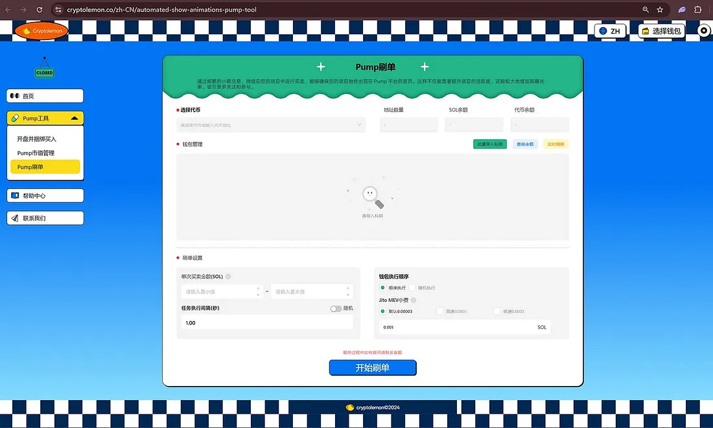
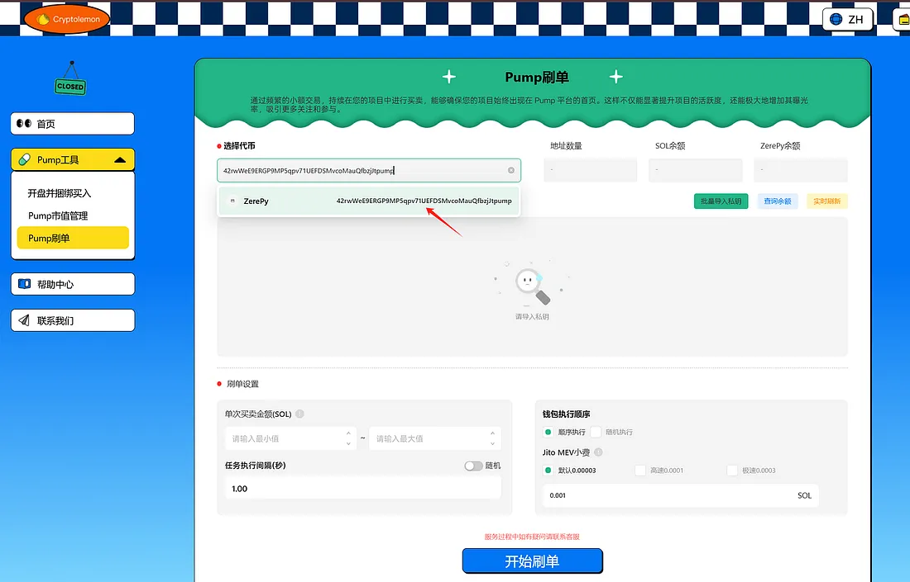
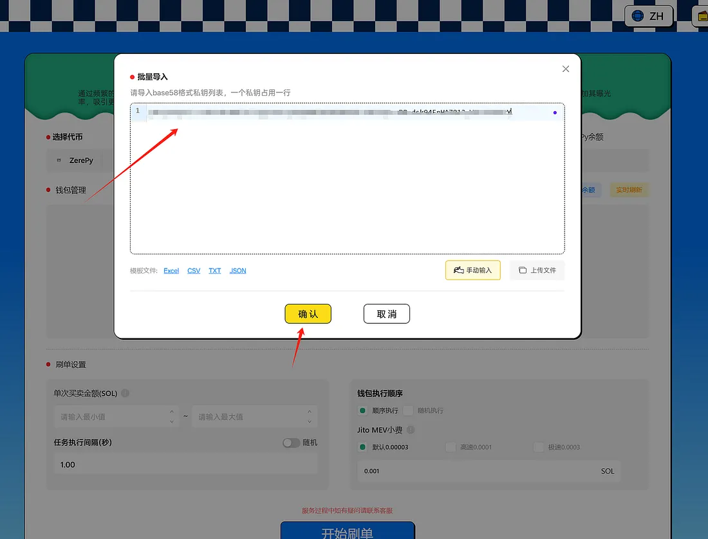
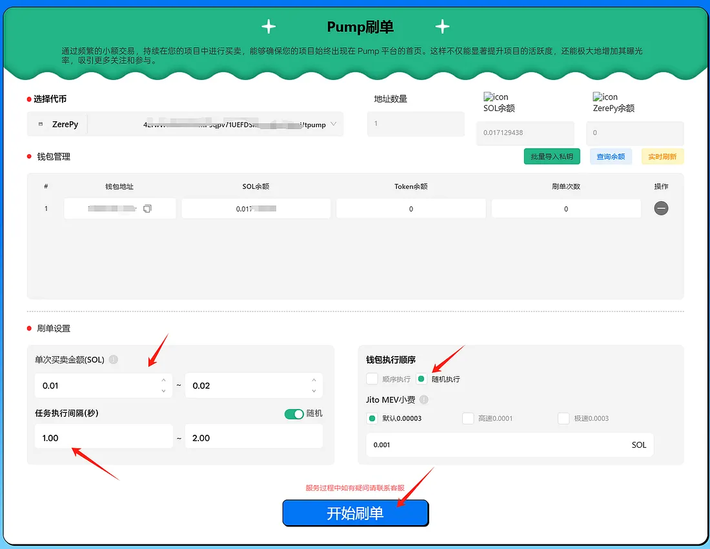
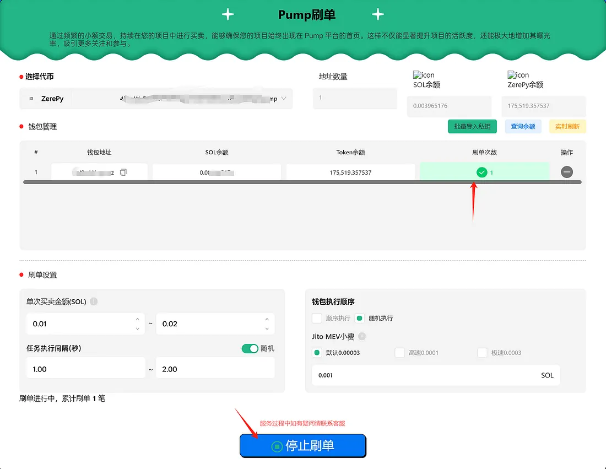

# Pump 刷单工具使用手册

### 核心功能

1. **持续微量交易，快速刷单操作**
   - 自动化的小额买入卖出交易，频繁刷新 Pump.fun 平台首页，提高代币的市场曝光。

2. **灵活设置参数，满足多样化需求**
   - 自由设定交易金额范围和交易间隔，适配不同的市场策略。

3. **全自动执行，操作便捷高效**
   - 系统自动完成交易流程，无需手动干预。

4. **提高市场活跃度，提升排名**
   - 频繁的交易动态直接影响市场排名，使您的代币成为关注焦点。

---

### 使用方法

1. **进入工具界面**  
   登录 [Pump 刷单工具页面](https://cryptolemon.co/zh-CN/automated-show-animations-pump-tool)，选择对应的刷单功能。
   

2. **选择代币**  
   连接钱包后，选择需要刷单的代币，或手动输入代币地址。
   

3. **导入钱包**  
   支持手动粘贴私钥或上传 JSON/CSV 文件导入钱包。推荐只在钱包中保留操作所需的最低资产。

4. **设置交易参数**  
   - 自定义每笔交易的金额（建议范围为 0.01 至 0.02 SOL）。  
   - 调整交易间隔时间（例如 1-2 秒）。  
   - 选择钱包执行顺序（随机或固定顺序）。 

    

   > **注意**：单次买卖金额不得低于 0.01 SOL。根据 Pump.fun 的规则，只有满足交易额不低于 0.01 SOL 的交易记录才会触发首页闪烁效果。交易额越高，首页闪烁的概率越大！

5. **启动刷单操作**  
   点击“开始刷单”按钮，系统将自动执行刷单任务。页面会显示交易记录，成功交易以绿色显示。

6. **停止刷单**  
   如需结束任务，可随时点击“停止刷单”按钮终止操作。

---

### 注意事项
- 妥善保管私钥钱包，建议钱包中只存放最低操作所需的资金，避免不必要的资金暴露。
- 交易失败可能是由于网络拥堵或钱包余额不足，您可以尝试切换 RPC 或增加 Jito 费用。

---

### 常见问题

#### 交易失败的原因是什么？
交易失败的原因可能与链上网络拥堵有关，您可以切换 RPC 服务器或调整 Jito 费用，多次尝试。如果问题持续存在，请加入我们的 [客服群](https://t.me/cryptolemongroup) 联系客服。
