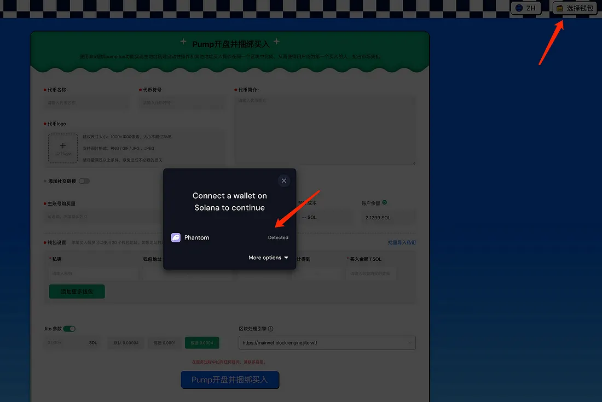
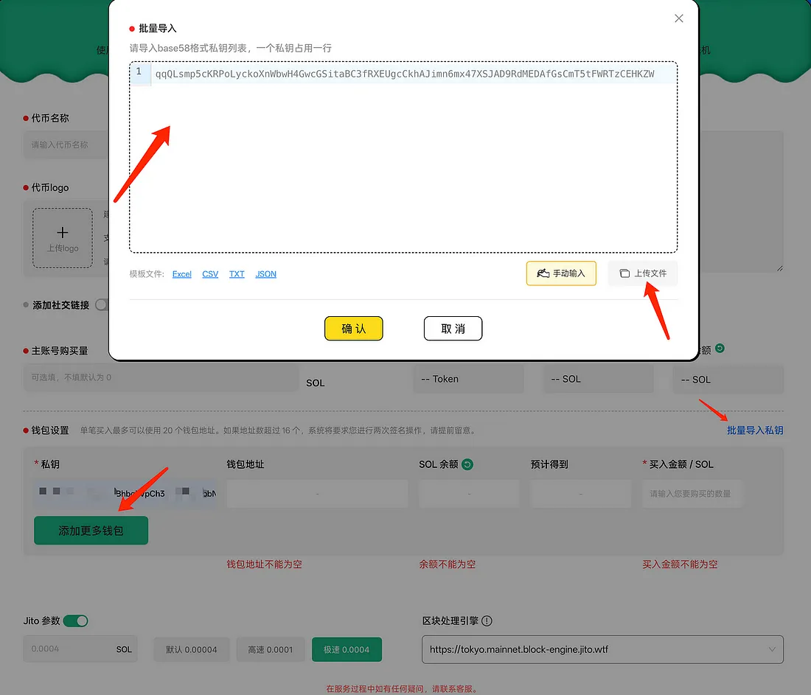
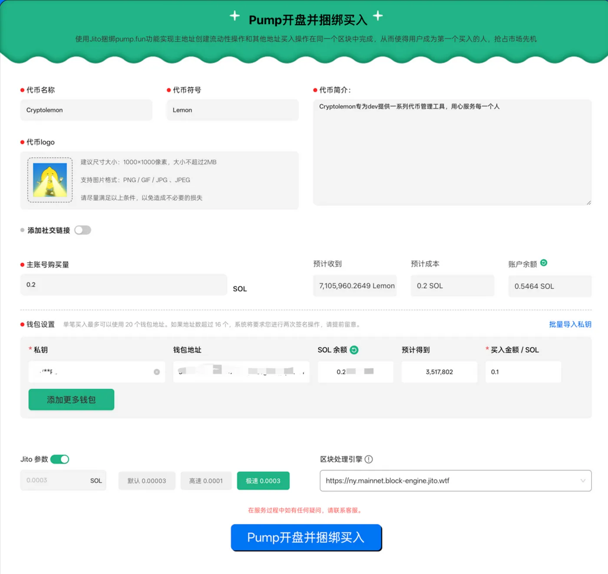
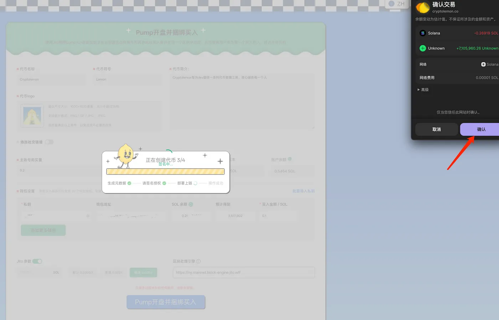

# Pumpfun 开盘并捆绑买入工具使用手册
[Switch to English Version](../en/pump_launch_and_bundled_buy_tool_user_guide.md)
## 核心功能

### 1. 批量捆绑买入
通过 Jito 工具实现多钱包同时操作，达到高效批量买入效果。

### 2. 自动化执行
系统全程自动化处理，无需手动干预，大幅节省时间。

### 3. 灵活参数配置
支持设置每个钱包的买入金额，确保更精准的资金分配策略。通过捆绑买入操作，在开盘瞬间即可达到市值预定目标，掌握更多市场份额。

### 4. 迅速提升市值，引爆热度
利用捆绑买入操作提升代币市值，快速占领市场高地，并确保更多代币仓位掌握在自己手中。

---

## 使用方法

### 1. 进入工具界面
访问 [Pump 开盘并捆绑买入工具页面](https://cryptolemon.co/zh-CN/pump-launch-and-buy-token/solana)，选择对应功能。

### 2. 连接钱包
使用支持的多种钱包连接方式导入钱包，可手动粘贴私钥或通过文件批量导入。

### 3. 导入钱包
您可以点击[批量导入私钥]手动复制导入，也可以选择上传文件导入，还可以点击下方的添加更多钱包按钮，手动将私钥输入到私钥框进行导入。

 > 注意：我们建议您在使用过程中，钱包中仅存放操作所需的最低资产。我们不鼓励，也不建议将过多的资产留在钱包中，因为这始终不是一个良好的习惯。

### 4. 填写代币信息
输入代币名称和详细参数，导入需要购买的其他钱包地址，并设置买入金额和jito小费额度。本文图示为一个钱包捆绑买入，您可自行设置多个钱包。最多支持20个钱包捆绑买入

### 5. 确认Pump开盘并捆绑买入
点击【Pump开盘并捆绑买入】 按钮，提交代币信息，接下来页面会出现以下提示：

### 6.确认交易
您只需要点击确认即可完成pump开盘并捆绑买入操作。

> 注意，如果一次捆绑买入的钱包数量超过16个时，需要您钱包签名两次。
如果您在使用的过程中遇到任何问题也非常欢迎来我们的[客服群咨询](https://t.me/cryptolemongroup)。我们24小时在线为您服务
---

## 注意事项
- 妥善保管私钥钱包，仅保留足够交易的金额，减少不必要的资金暴露风险。
- 交易过程中如遇问题，请联系 [Cryptolemon 官方客服](https://t.me/cryptolemongroup)获取帮助。

---

## 常见问题

### 1. 为什么交易失败？
交易失败的原因可能是网络拥堵或钱包余额不足。请检查钱包中的 SOL 余额是否充足并重试。

### 2. 交易失败会扣手续费吗？
不会。手续费和捆绑操作一同执行，要么成功一起扣费，要么失败不扣费。

### 3. 会部分失败吗？
不会。捆绑操作依赖 Jito 工具，要么所有钱包全部成功，要么全部失败。

---

## 更多功能推荐
- [Pump 市值管理工具](https://cryptolemon.co/zh-CN/auto-batch-pump-trading)：实现智能市值管理，轻松控制市场表现。
- [Pump 刷单工具](https://cryptolemon.co/zh-CN/automated-show-animations-pump-tool)：通过微量频繁交易提升曝光和交易量。

---

## 联系我们
- 加入我们的 [客服群](https://t.me/cryptolemongroup) 获取最新动态和支持。

---

