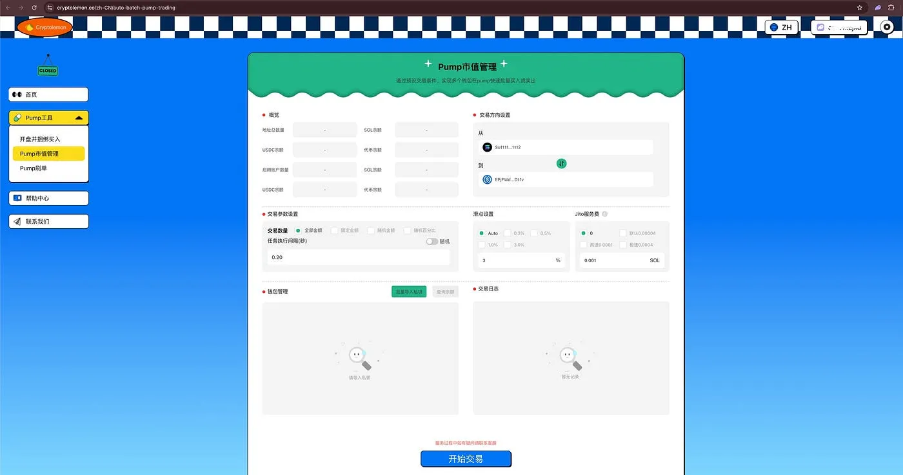
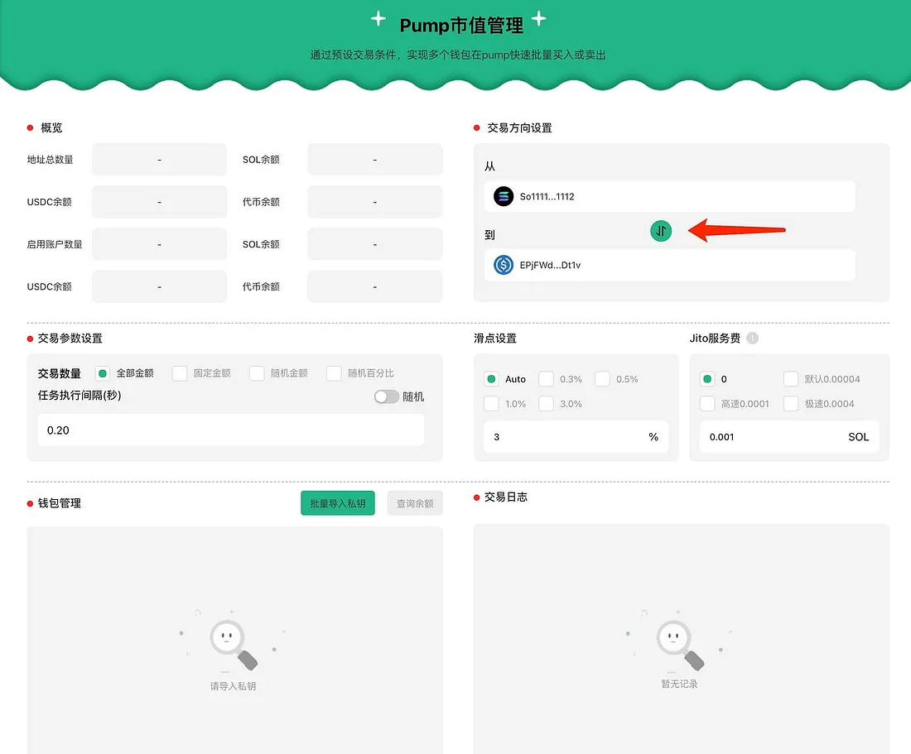
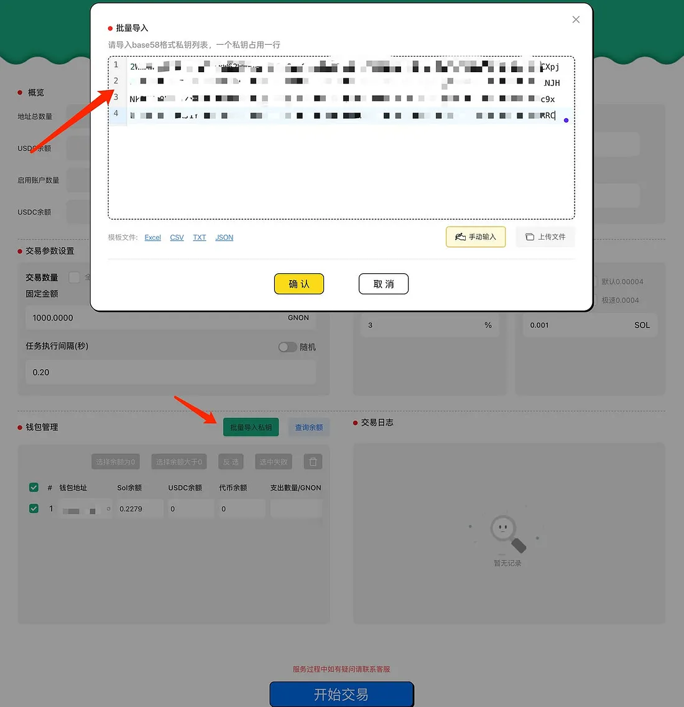
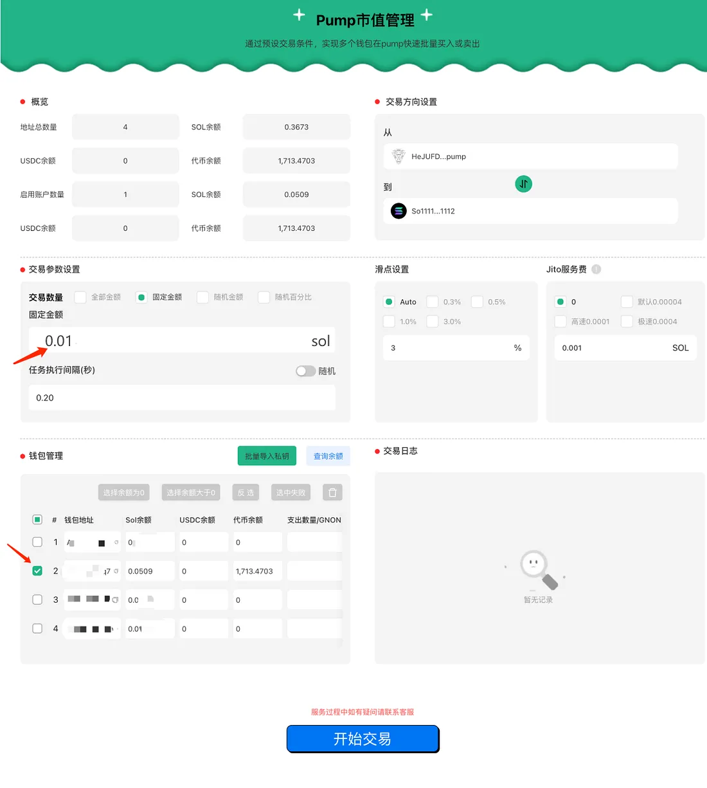
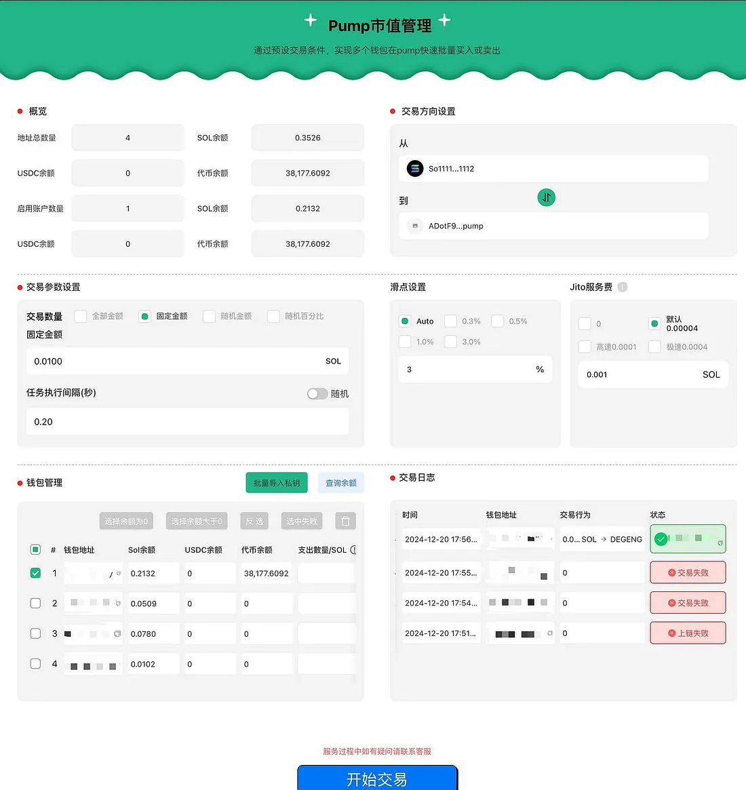

# Pump 市值管理工具使用手册
[Switch to English Version](../en/pump-volume-bot.md)
## 核心功能

1. **智能批量交易，快速买入与卖出**  
   借助 Jito 工具，批量管理多个钱包，实现同步买入操作，快速掌控市场动向，抢占市场先机，同时有效分散持仓风险。  
   通过批量控制多钱包执行卖出操作，能够在市场波动的关键时刻迅速止损，快速退出市场，保护资金安全。

2. **市场活跃度提升**  
   利用批量买卖操作提升代币市场表现，增强市场活跃度，确保项目始终处于投资者视野中。

3. **灵活参数配置，策略自定义**  
   - 支持设置固定金额的买入或卖出操作。  
   - 可自定义单笔交易金额范围，或选择按持仓的百分比进行交易，满足多种策略需求。

4. **精准市值控制**  
   通过调整交易频率和参数，助力实现市值目标，提升项目的市场竞争力。

---

## 使用方法

### 1. 进入功能页面
访问 [Pump 市值管理工具页面](https://cryptolemon.co/zh-CN/auto-batch-pump-trading)，选择“Pump 市值管理”功能。

### 2. 调整买卖方向
点击功能界面中的方向选择按钮，设置买入或卖出的操作：

- 如果 SOL 位于上方，表示买入操作（使用 SOL 兑换代币）。
- 如果代币位于上方，表示卖出操作（使用代币兑换 SOL）。

### 3. 导入钱包
选择手动输入钱包或通过 CSV、JSON 等格式导入。确保钱包中有足够的 SOL 支付交易费用。本文以手动导入为例，您也可以根据需要选择其他方式。

### 4. 设置参数
选择需要操作的钱包，调整交易参数，点击“开始交易”。例如，可以设置钱包用 0.01 SOL 买入代币。

###  5. 点击 【开始交易】

等待交易完成，结果会显示在交易日志区域。成功的交易以绿色显示。如果交易失败，可以尝试提高 Jito 服务费后重新执行

---

## 注意事项

- 妥善保管私钥钱包，仅保留足够交易的金额，减少不必要的资金暴露风险。
- 交易过程中如遇问题，请[联系 Cryptolemon 官方客服](https://t.me/cryptolemongroup)获取帮助。

---

## 常见问题

### 为什么交易失败？
交易失败的原因可能是链上网络拥堵或钱包余额不足。请检查钱包中的 SOL 余额是否充足，切换 RCP 或调整 Jito 小费多次尝试。如果问题持续存在，可以 [联系客服群](https://t.me/cryptolemongroup) 获取进一步支持。

---

## 更多功能推荐

- [Pump 开盘并捆绑买入工具](https://cryptolemon.co/zh-CN/pump-launch-and-buy-token/solana)：快速实现开盘操作，抢占市场先机。
- [Pump 刷单工具](https://cryptolemon.co/zh-CN/automated-show-animations-pump-tool)：提升市场热度和交易频率。

---

## 联系我们

加入我们的 [客服群](https://t.me/cryptolemongroup) 获取最新动态和支持。
