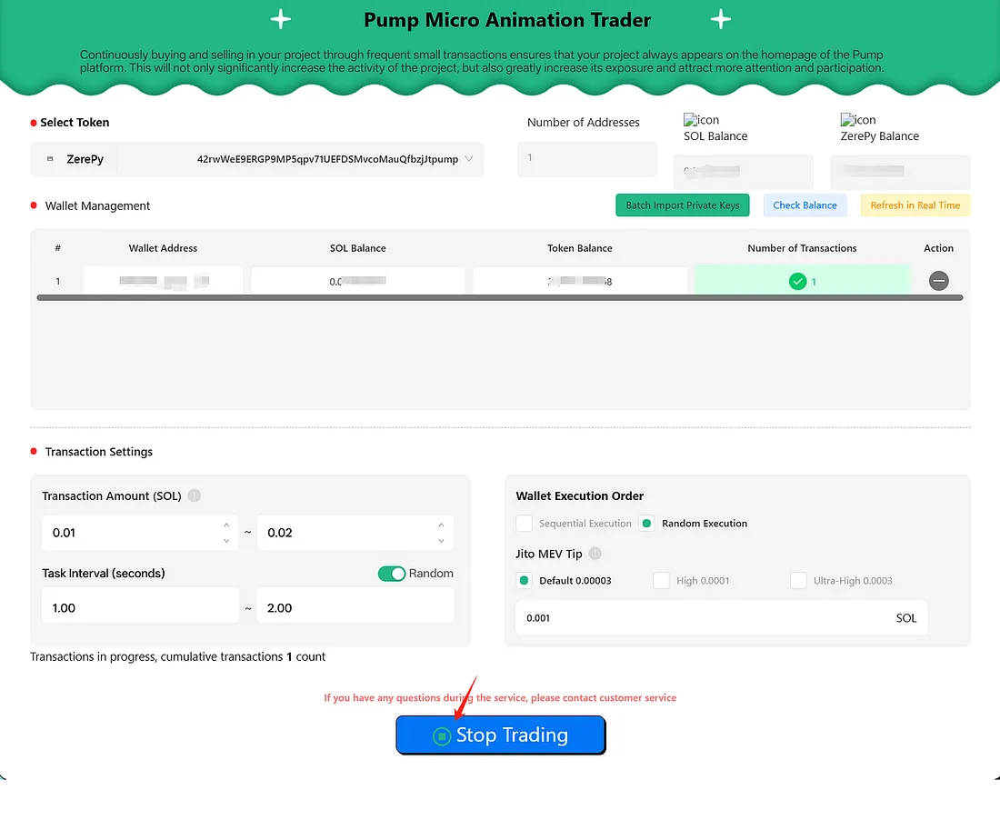

# Pump Automated Flashing Tool User Manual
[切换到中文版本](../cn/automated-show-animations-pump.md)
### Core Features

1. **Continuous Micro-Trading for Frequent Market Presence**  
   
   This tool enables rapid micro buy-sell trades that refresh frequently on the Pump.fun homepage, drawing more investor attention and boosting market engagement.

2. **Flexible Parameter Configuration**  

   Adjust trading parameters, including transaction amounts and execution intervals. Terminate operations anytime for full control.

3. **Automated Execution for Convenience**  

   Automate all trading tasks with no manual intervention needed, saving time and reducing errors.

4. **Boost Market Activity and Rankings**  

   Increased trading frequency improves token visibility and activity, securing a better ranking on Pump.fun.

---

### How to Use

#### 1. Access the Tool Interface
Go to the [Pump Micro Animation Trader](https://cryptolemon.co/en-US/automated-show-animations-pump-tool) page on Cryptolemon and select the corresponding feature.
  
   
#### 2. Choose a Token
Connect your wallet and choose from your holdings, or enter a token address directly.
   
#### 3. Import Wallets

- Use the **Bulk Import Private Keys** button to add wallets.
- Supported formats include manual input or file uploads. Download the provided template if needed.
- Alternatively, manually paste private keys.

> **Note:** It is recommended to store only minimal funds needed for trading in your wallets for security purposes.

   
#### 4. Configure Parameters

Set trading parameters, such as:

- Buy-sell amount: Between 0.01 and 0.02 SOL per transaction.
- Interval: 1-2 seconds.
- Execution method: Random wallet execution.
   
> **Important:** The minimum amount for a single transaction is 0.01 SOL. According to Pump.fun’s rules, only trades of at least 0.01 SOL trigger homepage flashing. Higher trade amounts increase flashing frequency.

#### 5. Start Flashing

Click **[Start Flashing]** to begin automated trading.

- Completed trades appear in the trade log.
- Stop anytime by clicking **[Stop Flashing]**.
   

For any issues, contact our [support group](https://t.me/cryptolemongroup).

---

### Precautions

- Store your private keys securely and keep only the necessary trading funds in wallets to minimize exposure.
- For help, contact official Cryptolemon support.

---

### FAQ

1. **Why does my transaction fail?**  
   This could be due to network congestion or insufficient SOL balance. Check your wallet and try adjusting the Jito fee or switching RPC nodes. Contact support if the issue persists.

---

### More Recommended Tools

- [Pump Market Cap Management Tool](https://cryptolemon.co/en-US/auto-batch-pump-trading): Efficient market management to stabilize and enhance performance.
- [Pump Launch and Bundled Buy Tool](https://cryptolemon.co/en-US/pump-launch-and-buy-token/solana): Gain an edge in market launches with simultaneous buy operations.

Join our [support group](https://t.me/cryptolemongroup) for more updates and assistance.

