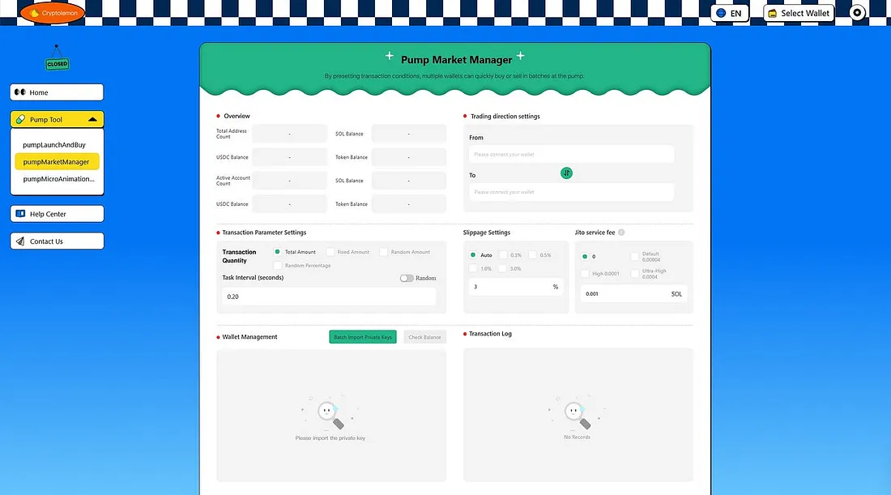
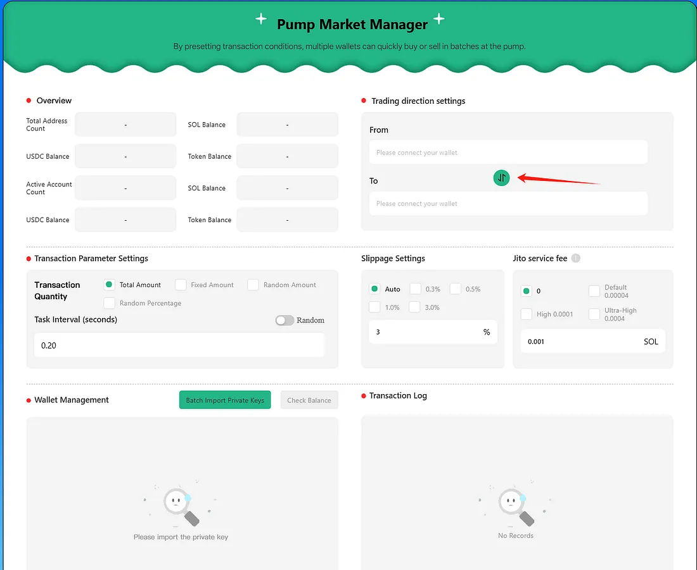
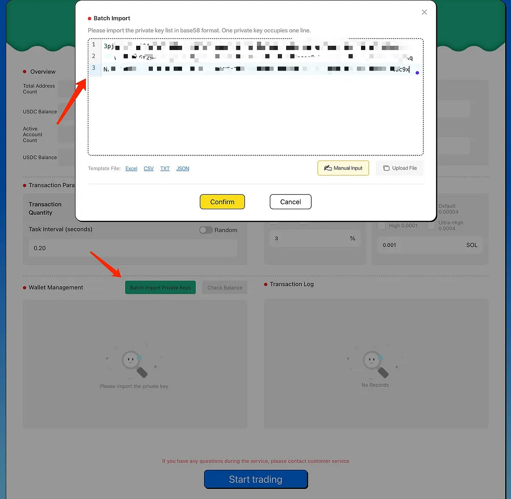
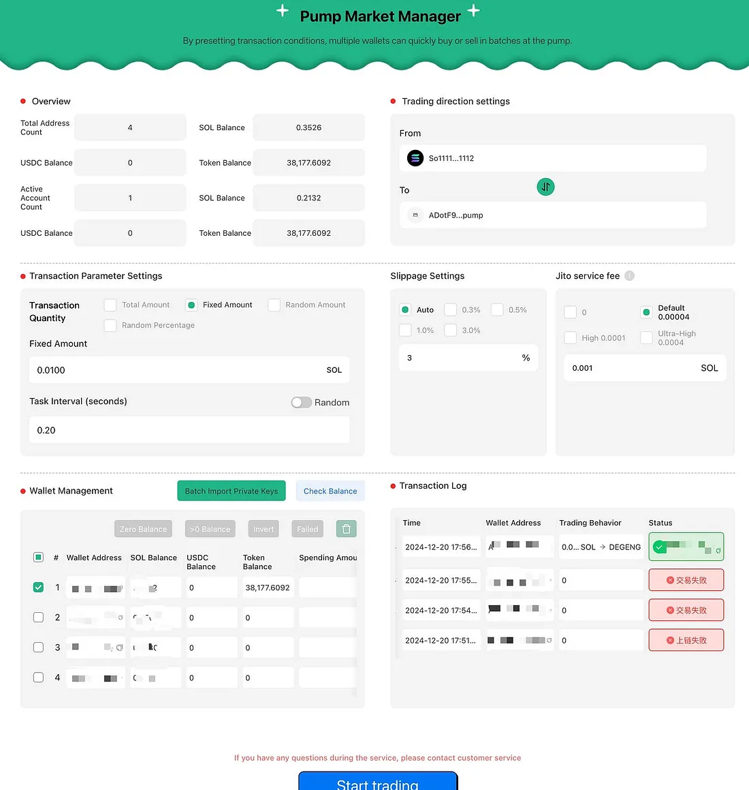

# Pump Market Management Tool User Guide

## Core Features

1. **Batch Buy and Sell Operations**  
   Leverage the Jito tool to manage multiple wallets simultaneously, enabling synchronized buy operations for swift market control and rapid market position acquisition. Additionally, execute batch sell operations to swiftly cut losses and exit the market at critical moments, effectively dispersing and balancing your holdings.

2. **Automated Execution**  
   Complete automation of all processes eliminates the need for manual intervention, saving significant time and effort.

3. **Flexible Parameter Configuration**  
   Customize wallet-specific transaction parameters. Define fixed amounts for buy or sell orders, set percentage ranges for purchases, and control transaction behavior to optimize strategy.

4. **Instant Market Cap Increase and Exposure**  
   Boost token market cap in real-time and amplify project visibility by executing coordinated purchase operations.

---

## How to Use

1. **Access the Tool**  
   Open the [Pump Market Management Tool](https://cryptolemon.co/en-US/auto-batch-pump-trading) on the Cryptolemon platform and select the relevant feature.

2. **Set Buy or Sell Direction**  
   Use the direction selection button to configure buy or sell actions:

   - If SOL is shown on top, the operation is a buy action (converting SOL to tokens).
   - If tokens are shown on top, the operation is a sell action (converting tokens to SOL).

3. **Import Wallets**  
   Manually input wallets or upload them via CSV or JSON files. Ensure that wallets contain sufficient SOL to cover transaction fees. This guide uses manual input as an example, but you may choose other options.

4. **Configure Parameters**  
   Select the wallets for operation, set transaction parameters, and click "Start Trading." For example, configure wallets to use 0.01 SOL to purchase tokens.

5. **Initiate Trading**  
   Click the [Start Trading] button. Transaction results will display in the trading log. Successful trades appear in green. If a transaction fails, consider increasing the Jito service fee and retrying.

If you encounter any issues, feel free to contact our [customer support group](https://t.me/cryptolemongroup) for assistance.

---

## Precautions
- Safeguard your private key wallets and store only minimal funds needed for operations to reduce unnecessary exposure.
- For any problems during transactions, reach out to Cryptolemon’s official support team.

---

## FAQ

### Why does a transaction fail?
Network congestion or insufficient SOL balance in your wallet may cause failure. Switch to a different RPC or increase the Jito fee, then try again. If the problem persists, contact our [customer support group](https://t.me/cryptolemongroup) for assistance.

---

## More Tools
- **[Pump Launch and Token Bundled Buying](https://cryptolemon.co/en-US/pump-launch-and-buy-token/solana):** Automatically handle token launches and bundle buy operations to seize market opportunities.
- **[Pump Flash Animation Tool](https://cryptolemon.co/en-US/automated-show-animations-pump-tool):** Boost transaction volume and visibility through frequent microtransactions.

---

Join our [customer support group](https://t.me/cryptolemongroup) to stay updated and get support!

