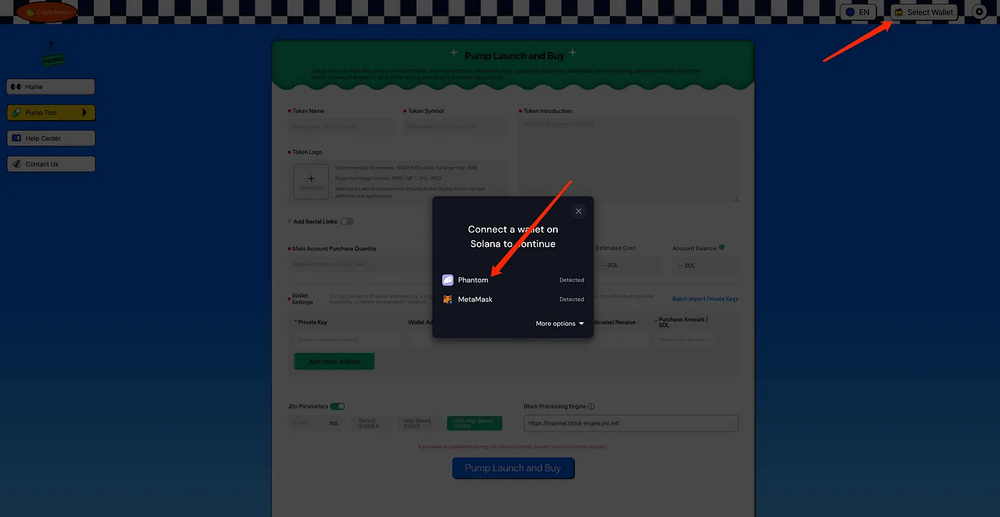
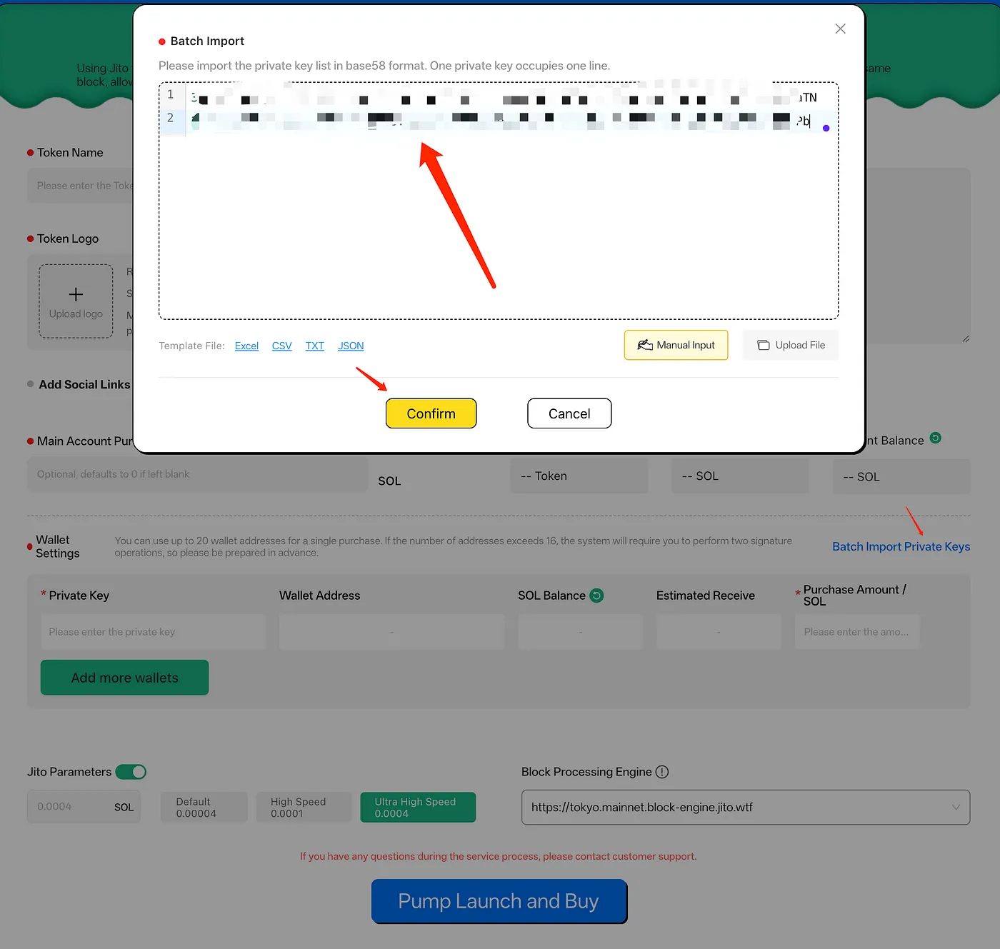
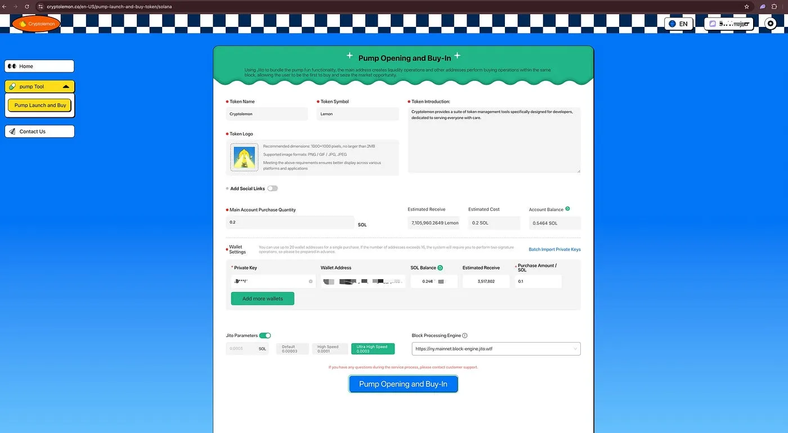
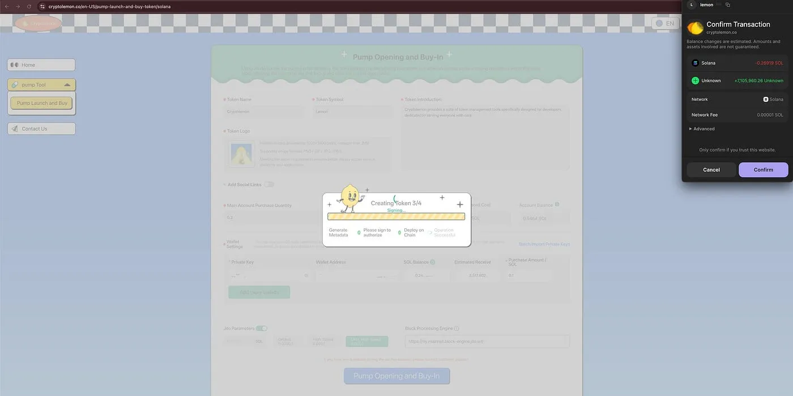

# Pumpfun Launch and Bundled Buy Tool User Guide

## Key Features

1. **Batch Bundled Buy**
   Execute highly efficient bulk purchases with multiple wallets simultaneously using the Jito tool.

2. **Automated Execution**
   The entire process is automated, eliminating the need for manual intervention and saving significant time.

3. **Flexible Parameter Configuration**
   Set the purchase amount for each wallet, enabling precise capital allocation strategies. With the bundled buy operation, achieve the preset market value target instantly at launch and secure a larger market share.

4. **Rapid Market Cap Boost and Heat Explosion**
   Use bundled buy operations to quickly increase token market cap, capture market dominance, and retain a larger share of tokens.

## How to Use

### 1. Access the Tool Interface
Visit the [Pump Launch and Bundled Buy Tool](https://cryptolemon.co/en-US/pump-launch-and-buy-token/solana) page and select the corresponding feature.

### 2. Connect Your Wallet
Import wallets using various supported connection methods. You can manually paste private keys or use batch file imports.

### 3. Import Wallets
Click **[Batch Import Private Keys]** to copy and paste manually, upload files, or add more wallets by entering private keys in the input box.

**Note:** We recommend storing only minimal assets required for operations in your wallets. Avoid keeping excessive funds to minimize risk exposure.

### 4. Input Token Information
Provide token names and parameters, import additional wallet addresses, and set purchase amounts and Jito fee limits. The example shows a single wallet; you can configure up to 20 wallets for bundled buying.

### 5. Confirm Pump Launch and Bundled Buy
Click **[Pump Launch and Bundled Buy]** to submit token information. A prompt will appear as follows:

### 6. Confirm the Transaction
Click **Confirm** to complete the Pump launch and bundled buy operation.

**Note:**  When bundling more than 16 wallets, two signature confirmations are required.
If you encounter any issues, feel free to reach out to our [support group](https://t.me/cryptolemongroup). We are available 24/7 to assist you.

## Important Notes
- Safeguard your private keys and only keep the necessary funds for transactions to reduce unnecessary exposure.
- [Contact Cryptolemon’s official support](https://t.me/cryptolemongroup) if any issues arise during transactions.

## FAQs

1. **Why did my transaction fail?**
   Transaction failure could be due to network congestion or insufficient wallet balance. Ensure your wallet has enough SOL and try again.

2. **Will fees be deducted if the transaction fails?**
   No. Fees and bundled operations are executed together—either both succeed, or neither is charged.

3. **Will partial transactions fail?**
   No. Bundled operations rely on the Jito tool, meaning either all wallets succeed together, or all fail together.

## Additional Recommended Tools
- [Pump Market Cap Management Tool](https://cryptolemon.co/en-US/auto-batch-pump-trading): Manage market cap intelligently and control market performance.
- [Pump Trading Volume Boost Tool](https://cryptolemon.co/en-US/automated-show-animations-pump-tool): Increase exposure and trading volume with micro-frequency trades.

## Contact Us
Join our [support group](https://t.me/cryptolemongroup) for the latest updates and assistance.

